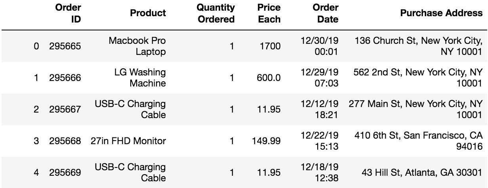
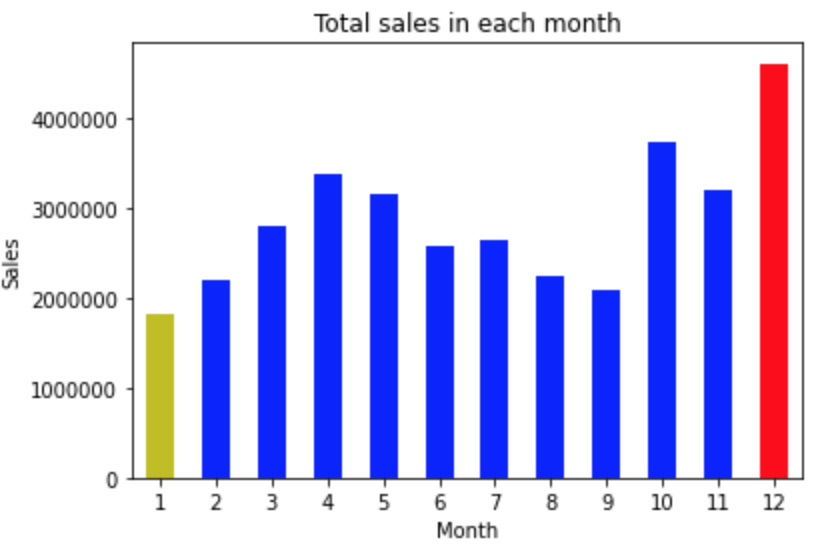
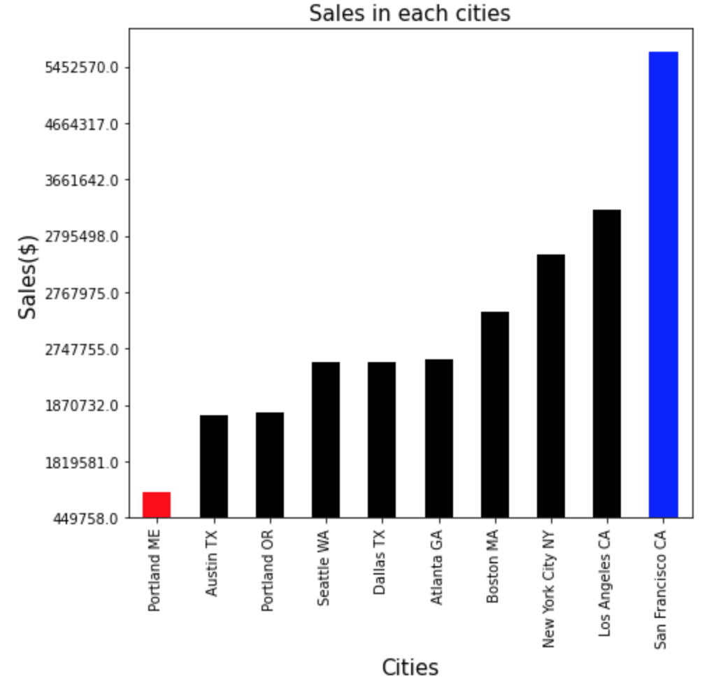
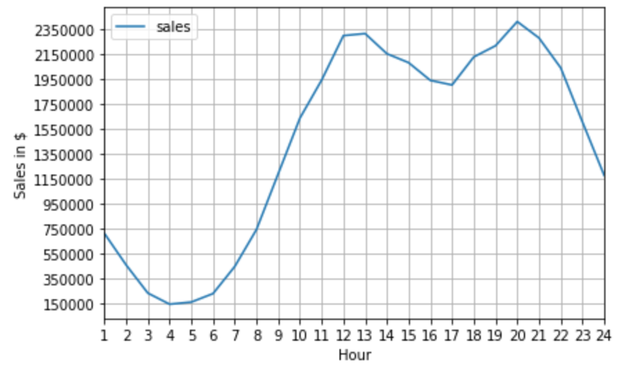
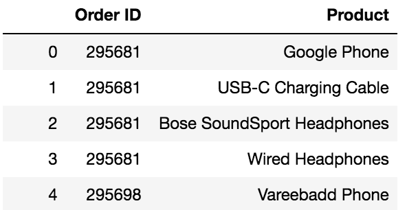
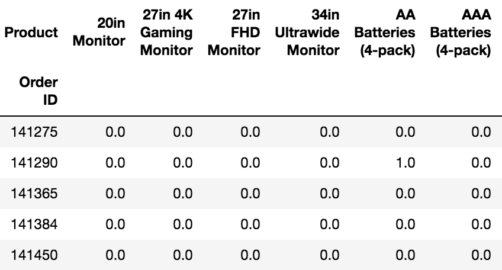

# Sales Analysis

***Installation and Import***
```
import pandas as pd

import numpy as np
import matplotlib.pyplot as plt

# # To merge 12 months of sales data into a single file
import os
import glob

# for association analysis
pip install mlxtend
from mlxtend.frequent_patterns import apriori
from mlxtend.frequent_patterns import association_rules
```

***Import then merge the dataset***
```
# selecting working folder
path="/Users/kitaeklee/PycharmProjects/sales/Sales_Data"

# collect all files needed to be combined
all_files = glob.glob(os.path.join(path, "Sales_*.csv"))

# read, concatenate
merged_file = pd.concat((pd.read_csv(f, sep=',') for f in all_files), ignore_index=True)

# export as CSV to the local directory
merged_file.to_csv("/Users/kitaeklee/PycharmProjects/sales/merged_file.csv", index=False)
```
Merged file looks like below:


```
# To remove SettingWithCopyWarning
pd.options.mode.chained_assignment = None  # default='warn'
```

***Data Cleaning***
```
# # # Data Cleaning: Drop the rows with missing values or categorical values

# Drop rows with null values
merged_file.dropna(subset=['Order ID'], inplace=True, axis=0)
# Reassign the values to merged_file where the values of 'Order date'.str[0:2] are not 'Or' to drop categorical variables
merged_file = merged_file[merged_file['Order Date'].str[0:2] != 'Or']

merged_file.reset_index(inplace=True, drop=True)
```


***1. The best and the worst month for sales***
```
#########################################################################
# # # 1. The best month for sales and how much earned in that month

# add an additional column for the month of the Order Date
merged_file['Order Month'] = merged_file['Order Date'].str[:2]
merged_file['Order Month'] = merged_file['Order Month'].astype('int32', copy=False)

# change the data types to float
merged_file['Quantity Ordered'] = merged_file['Quantity Ordered'].astype('float64', copy=False)
merged_file['Price Each'] = merged_file['Price Each'].astype('float64', copy=False)
# Create Sales column
merged_file['sales'] = (merged_file['Quantity Ordered'] * merged_file['Price Each'])
```
- Create a new Dataframe for sales and month
```
# sum of 'sales', to each 'Order Month' then max out of all.
best_sales = merged_file.groupby('Order Month')['sales'].sum().max()

# create a new dataframe with months and sales
month_sales = merged_file.groupby('Order Month')['sales'].sum().reset_index()
```
- Plot the dataframe using bar graph
```
# Visualization

colors = list('ybbbbbbbbbbr')

month_sales.plot(x='Order Month', y='sales', kind='bar', color=colors,
                legend=None)
plt.ticklabel_format(useOffset=False, style='plain', axis='y')
plt.xticks(rotation=360)
plt.xlabel('Month')
plt.ylabel('Sales')
plt.title('Total sales in each month')
```


***2. Which city has the highest and the lowest sales?***

- Create a new Dataframe
```
# Create a new column for cities
merged_file['city'] = merged_file['Purchase Address'].str.split(",")
merged_file['city'] = merged_file['city'].str.get(1)

# To deal with the duplicates of the name of the cities, create state column
merged_file['state'] = merged_file['Purchase Address'].apply(lambda x: x.split(",")[2])
def split_state(address):
    return address.split(" ")[1]
merged_file['state'] = merged_file['state'].apply(lambda x: split_state(x))
merged_file['city'] = merged_file['city'] + " " + merged_file['state']
```
```
# Create Dataframe for sum of sales that grouped by cities and states
sales_sum_city = merged_file.groupby(['city', 'state'])['sales'].sum()
sales_sum_city = sales_sum_city.to_frame()      # convert series into dataframe
sales_sum_city = sales_sum_city.reset_index()
sales_sum_city['sales'] = sales_sum_city['sales'].astype('str')
sales_sum_city['sales'] = sales_sum_city['sales'].apply(lambda x: x.split(".")[0])
sales_sum_city['sales'] = sales_sum_city['sales'].astype('float')
```

- Plot the Dataframe
```
# Visualize

colors = list('rkkkkkkkkb')
ax = sales_sum_city.plot(kind='bar', x='city', y='sales', 
                         color=colors, figsize=(7,7), legend=None)
ax.set_xticklabels(sales_sum_city['city'])
ax.set_yticklabels(sales_sum_city['sales'])
ax.set_title('Sales of each cities')
plt.ylabel('Sales($)', fontsize=15)
plt.xlabel('Cities', fontsize=15)
plt.title('Sales in each cities', fontsize=15)
plt.tight_layout()
plt.show()
```


***3. What time should we display advertisements to maximize likelihood of customers' buying product?***
```
# Create new columns for date, hours and minutes
merged_file['Order Date'] = pd.to_datetime(merged_file['Order Date'])
merged_file['Hour'] = merged_file['Order Date'].dt.hour
merged_file['Minute'] = merged_file['Order Date'].dt.minute
```
- Create a new Dataframe only with hours and sales
```
# Create a new Dataframe only with Hour and Sales
sales_sum_hour = merged_file['sales'].groupby(merged_file['Hour']).sum().round(0)
sales_sum_hour = sales_sum_hour.to_frame()
sales_sum_hour = sales_sum_hour.reset_index(inplace=False)
sales_sum_hour['Hour'] = list(map(int, range(1,25)))
sales_sum_hour['sales'] = sales_sum_hour['sales'].astype('float')
```
- Visualize using Line Plot
```
# Visualize using Line Plot

ax = sales_sum_hour.plot(kind='line', x='Hour', y='sales')
ax.set_xticks(sales_sum_hour['Hour'])
ax.set_yticks(list(map(float, range(150000, 2500000, 200000))))
plt.ylabel('Sales in $')
plt.tight_layout()
plt.ticklabel_format(useOffset=False, style='plain')
plt.grid()
plt.show()
```


***4. What products are the most often sold together?***
By doing 
```
merged_file['Order ID'].nunique()
```
I could find that there are 178437 unique values while there are 185950 rows. Products are bought together if the sold products have the same Order ID.

- Create a new Dataframe only with 'Order ID' and 'Product'
```
id_product = merged_file.loc[:, ['Order Date', 'Product']]
id_product = merged_file.loc[:, ['Order ID', 'Product']]
```
- Create a new Dataframe with the 'Order ID' that have duplicates
```
id_duplicates = id_product[id_product['Order ID'].duplicated(keep=False)]
id_duplicates.sort_values(ascending=False, by='Order ID')
id_duplicates.reset_index(inplace=True)
id_duplicates = id_duplicates.drop(columns='index')
```
Then it returns the dataframe with only the values that have duplicated 'Order ID' for example the first 5 rows of the new dataframe is:



- One Hot Encoding
```
# One hot encoding
df_grouped = id_duplicates.groupby(['Order ID','Product'])['Product'].count().unstack().fillna(0).reset_index().set_index('Order ID')
```



 
